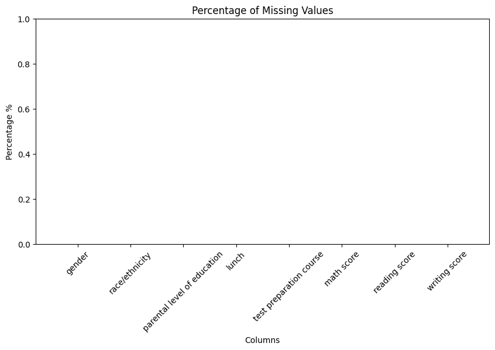
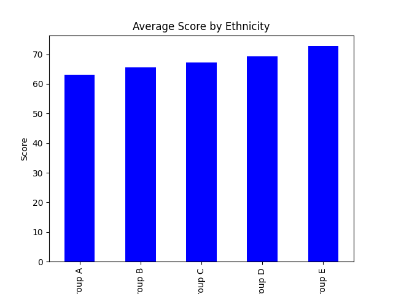
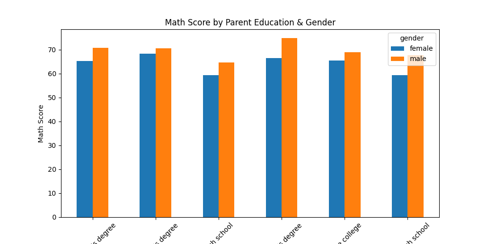
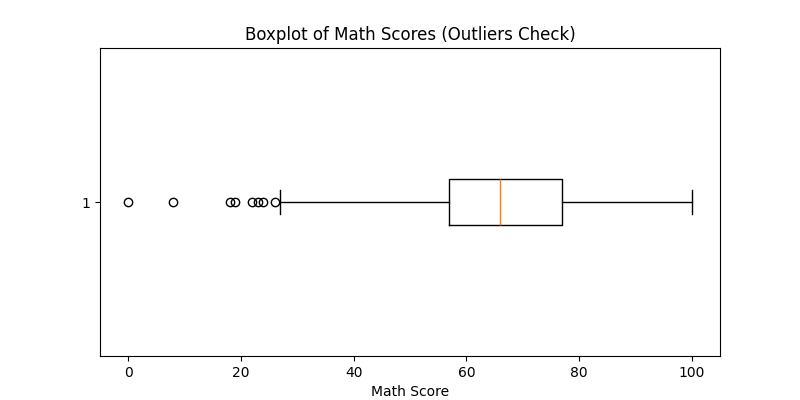
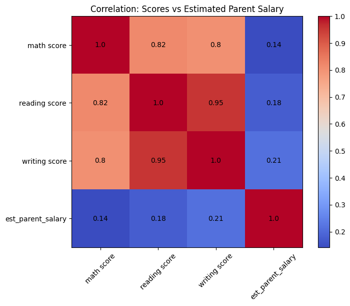
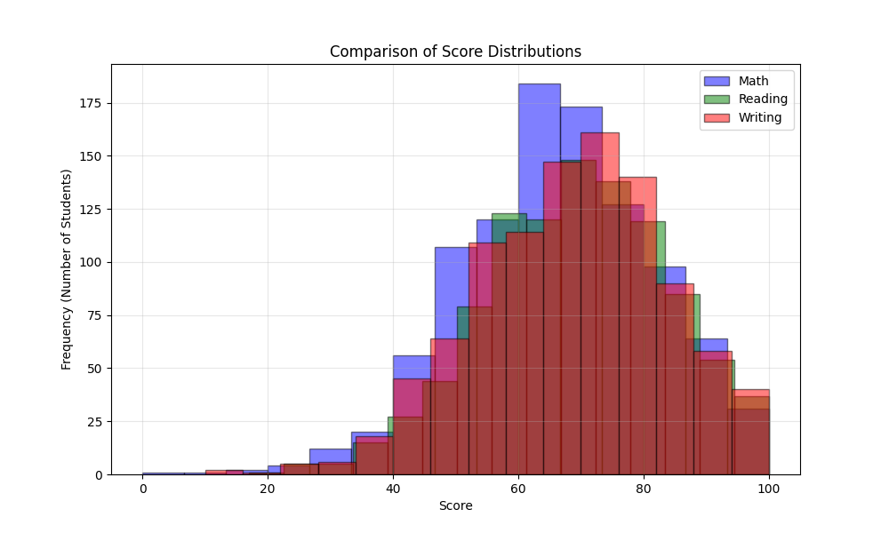

# Data-analysis-without-AI
This project demonstrates data analysis, without AI, using numpy, matplotlib, and pandas. It also shows techniques involved with Data Cleaning, combining datasets, Outlier Detection, Correlation Analysis, and Distribution Analysis.

Datasets Used:

Dataset 1 : https://www.kaggle.com/datasets/spscientist/students-performance-in-exams?resource=download

Dataset 2 : https://www.kaggle.com/datasets/mohithsairamreddy/salary-data

Results:
-Missing Values:

-Grouped and Pivot Diagrams:

After Combining 2 Datasets:
-Outlier Detection:

-Correlation Analysis:

-Distribution Analysis:
